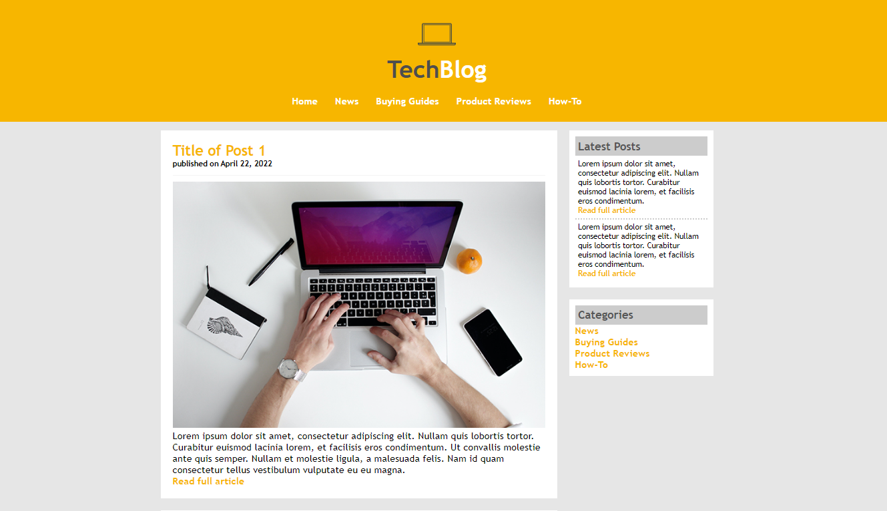

# TechBlog Landing Page

This project is a landing page of a fictional technology blog named TechBlog.
It was coded with HTML and CSS, with the purpose of showing that it's possible to 
create a simple but well designed website with essential HTML tags and basic CSS.

## Screenshot 

## Technology Stack

+ HTML
+ CSS
+ Image Editing